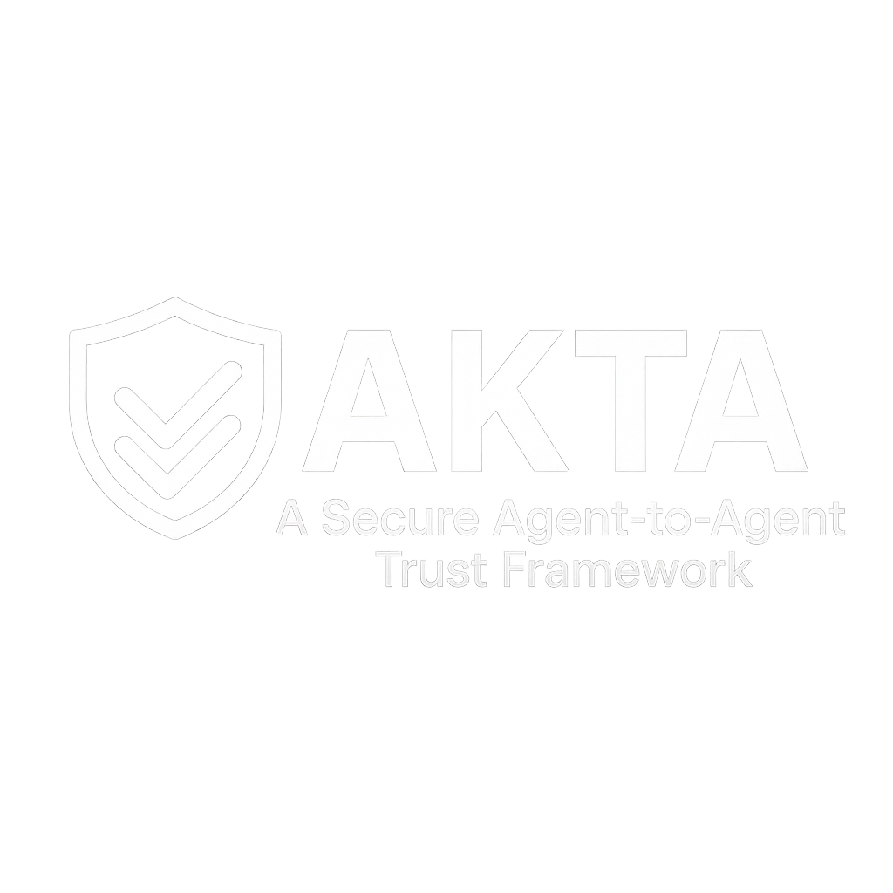

    <picture>
        <source srcset="./static/akta-logo-dark.png" media="(prefers-color-scheme: dark)">
        <source srcset="./static/akta-logo-light.png" media="(prefers-color-scheme: light)">
        
    </picture>

Akta is a prototype project designed to enable secure and verifiable interactions between AI agents. It establishes a robust framework for capability-based access control, allowing agents to confidently delegate tasks and share resources with fine-grained control. The system leverages concepts from Decentralized Identifiers (DIDs) and Verifiable Credentials (VCs) to create a cryptographically secure and auditable environment for autonomous agent operations.

**Important Note:** *Akta is currently a prototype. The codebase has not undergone a third-party security audit and is not yet considered suitable for production environments. Development will move fast, expect breaking changes, bugs, and other issues.*

## Quick Start

If you're just looking to get started, go direct to the [Quick Start Guide](./docs/quick_start.md).
and work through the steps there. You will then be up and running with a working.
system, and can start to experiment from there.

## Multi Framework Support

Akta is designed to be framework agnostic, and supports multiple frameworks out of the box.

### A2A Agent Framework

Akta is designed to be used with the A2A Agent Framework. It can ingest agent cards
and use them to issue and verify credentials.

### LangChain & LangGraph

Akta is designed to be used with the LangChain and LangGraph frameworks.

### Microsoft AG2

Akta is designed to be used with the Microsoft AG2 framework.

### Examples

See the [examples](./examples) directory for examples of how to use Akta with each framework.

## The Challenge: Trust in Autonomous Agent Ecosystems

As AI agents become more sophisticated and autonomous, ensuring trustworthy collaboration becomes paramount. How can an agent verify the permissions of another agent? How can an agent securely delegate a subset of its own capabilities to another? How can these interactions be auditable and resistant to tampering? Akta addresses these challenges by providing a standardized mechanism for issuing, verifying, and managing digital credentials that represent agent capabilities.

## Core Concepts and Utility

Akta introduces a specialized Verifiable Credential profile tailored for AI agent skills and authorizations. These credentials serve as digitally signed attestations that an agent possesses certain abilities or rights. Key utilities include:

*   **Verifiable Identity with DIDs:** Each agent can possess a cryptographically verifiable identity using Decentralized Identifiers. Akta is designed to be flexible with various DID methods, such as `did:key` for locally generated, self-sovereign identifiers, and `did:web` for associating identities with existing domain names. While methods like `did:key` are inherently decentralized, Akta's framework can also accommodate identity models where DIDs might be anchored or issued by specific authorities if a particular trust framework requires it. The core benefit is secure, unambiguous identification and agent-controlled keys for cryptographic operations.
*   **Verifiable Capabilities:** Permissions, or "skills," are encoded into Verifiable Credentials. These skills can be highly specific, detailing what actions an agent can perform, on which resources, and under what conditions (e.g., time limitations, usage quotas).
*   **Secure Storage and Retrieval:** A Verifiable Credential Repository (VC Store) allows agents to publish their credentials and for other agents (or the system itself) to retrieve and verify them. This ensures that credential status can be checked reliably.
*   **End-to-End Integrity:** All credentials and their proofs (e.g., JWS signatures) are designed to be tamper-evident, ensuring the integrity of the asserted capabilities from issuance to verification.

## Advanced Capability: Secure Delegation of Authority

A cornerstone of Akta is its support for secure delegation of capabilities. This allows an agent (the delegator) to grant a subset of its own skills to another agent (the delegatee) for a specific purpose or duration, without compromising its primary credentials.

The delegation mechanism works as follows:

1.  **Issuance of Primary Credential:** An authoritative agent (e.g., a root issuer or an agent with existing capabilities) issues a Verifiable Credential to a primary agent (e.g., Agent A), outlining its skills and specifying whether these skills can be delegated (`canDelegate: true`).
2.  **Storage of Primary Credential:** Agent A's credential is published to the VC Store, making it discoverable and verifiable.
3.  **Delegation Act:** If Agent A wishes to delegate a task, it creates a new Verifiable Credential (a "delegated VC"). This new VC:
    *   Specifies the delegatee agent (e.g., Agent B) as the subject.
    *   Is issued and signed by Agent A (the delegator).
    *   References Agent A's parent credential (from which the authority is derived).
    *   Details the specific skills being delegated (which must be a subset of Agent A's skills) and any new conditions (e.g., a shorter validity period or specific usage limits).
4.  **Verification of Delegated Authority:** When Agent B presents its delegated VC to perform an action:
    *   The system first verifies the signature on Agent B's VC (ensuring it was indeed issued by Agent A).
    *   It then retrieves Agent A's parent VC from the VC Store (using the reference in Agent B's VC).
    *   It verifies Agent A's parent VC, including its signature and its `canDelegate` status.
    *   It checks that the skills Agent B is trying to exercise are consistent with both the delegated VC and the parent VC, and that all conditions (like expiration and quotas) are met.

This chained verification process ensures that any delegated capability can be traced back to an authorized source and that all constraints on delegation are enforced. This enables complex collaboration scenarios where agents can temporarily empower other agents to act on their behalf in a secure and auditable manner.

## Use Cases and Future Considerations

Akta is designed for scenarios requiring verifiable, capability-based security for AI agents, such as:

*   **Automated Workflows:** Agents can delegate specific sub-tasks to specialized agents, ensuring each only has the permissions necessary for its part of the workflow.
*   **Resource Sharing with Granular Control:** Agents can grant temporary access to specific resources or data they control to other agents, including defining usage quotas (e.g., limiting the number of times an API can be called).
*   **Multi-Agent Systems:** In complex systems with numerous interacting agents, Akta can provide a clear and enforceable framework for permissions and authority.
*   **Foundation for Agent Communication Protocols:** Akta provides the runtime authorization layer for agent interactions. For instance:
    *   In emerging frameworks like the **Agent-to-Agent (A2A) protocol**, an agent's **AgentCard** (often an `agent.json` file) typically describes the agent and lists its available skills or capabilities. Akta complements this by providing the system for fine-grained, capability-based access control *for those specific skills*.
    *   If an AgentCard declares that an agent possesses a particular skill (e.g., "skill:processPayment"), an Akta Verifiable Credential (VC) would be the cryptographic token that grants another agent the *actual, verifiable permission* to invoke that payment processing skill. This Akta VC could further specify conditions, such as transaction limits or delegated authority from a primary account holder.
    *   Thus, Akta VCs operationalize the secure invocation, management, and delegation of skills that are advertised or discovered via mechanisms like AgentCards, ensuring that access is always based on verifiable, unforgeable credentials.
    *   Integration with protocols like Model Context Protocol (MCP) also remains a potential future direction, where Akta VCs could manage permissions for tools accessed via MCP.

By focusing on cryptographic verifiability and fine-grained, delegable capabilities, Akta aims to provide a foundational layer of trust for the burgeoning ecosystem of AI agents.

### Planned Enhancements and Broader Interoperability

To further enhance security, transparency, audibility, and reach, future development plans include:

*   **Integration with Sigstore/Rekor:** Leveraging transparency logs like Rekor for publishing and verifying credential issuance events, adding another layer of public auditability.
*   **Merkle Tree for VC Registry Integrity:** Implementing a Merkle tree or similar cryptographic accumulator for the VC Store to provide strong, verifiable proof of the registry's state and history.
*   **Support for Agent Frameworks:** Exploring integrations to provide Akta's capability-based security for agents built with popular frameworks such as **LangChain** and **Microsoft Autogen**. This would allow developers using these tools to easily incorporate robust, verifiable permissioning and delegation into their multi-agent systems.

## Contributing

We honestly love getting contributions, from engineers of all levels and background!

Don't be put off contributing, we're all learning as we go and everyone starts
somewhere.

You could always look for good first issues to get started, and tag me in the PR
(@lukehinds) and I am happy to give you plently of friendly support and guidance (if you want it).

## Using Akta?

If you're experimenting with Akta, please let us know! We'd love to hear about
your use case and how it's working for you!

## License

This project is licensed under the MIT License - see the [LICENSE](LICENSE) file for details.